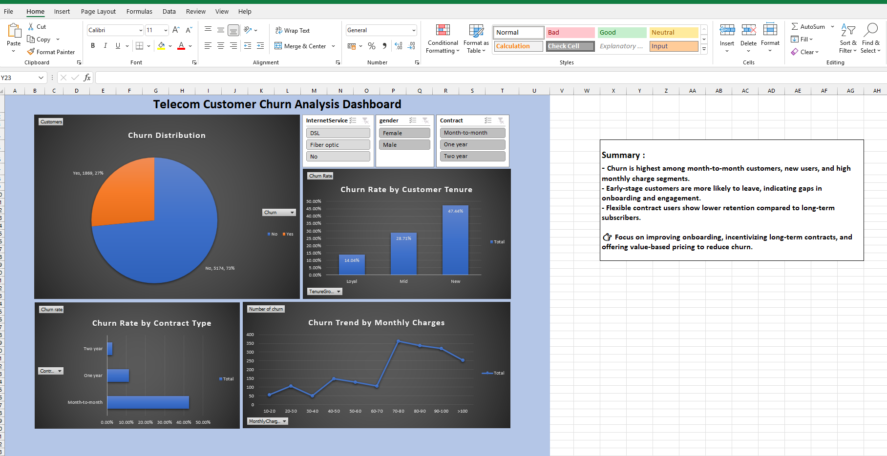

# 📞 Telecom Customer Churn Analysis Dashboard

## 👤 Developed by: `Andy`

---

## 📌 Project Overview
This project involves a comprehensive analysis of the **Telecom Customer Churn Dataset** from Kaggle. The goal was to identify key factors contributing to customer attrition and provide actionable insights to improve retention rates.

The dashboard was built using **Microsoft Excel**, leveraging Pivot Tables, Slicers, and advanced charting techniques to create an interactive reporting tool.

## 📊 Key Dashboard Features

### **1. Executive Summary & Insights**
* **Churn Distribution:** A pie chart visualization showing that **27% (1,869)** of customers have churned compared to **73% (5,174)** who stayed.
* **Strategic Recommendations:** Direct summary box highlighting high-risk segments (Month-to-Month contracts and new users) with suggestions for onboarding improvements.

### **2. Churn Drivers & Trends**
* **Churn Rate by Customer Tenure:** A bar chart revealing that "New" customers have the highest churn rate (**47.44%**), while "Loyal" customers are much more stable (**14.04%**).
* **Churn Rate by Contract Type:** Highlights that flexible **Month-to-Month** contracts are significantly more prone to churn compared to one or two-year commitments.
* **Monthly Charges Trend:** A line graph illustrating how churn spikes specifically in the **$70–$100** monthly charge bracket.

### **3. Interactive Filters (Slicers)**
Users can dynamically filter the entire dashboard by:
* **Internet Service:** DSL, Fiber optic, or No service.
* **Gender:** Female or Male.
* **Contract:** Month-to-month, One year, or Two year.

---

## 🛠️ Tools Used
* **Data Source:** [Kaggle - Telco Customer Churn](https://www.kaggle.com/datasets/mosapabdelghany/telcom-customer-churn-dataset/data)
* **Software:** Microsoft Excel
* **Techniques:** Data Cleaning, Pivot Tables, Pivot Charts, Slicers, and Conditional Formatting.
---
## 🖥️ Preview

---

## 🚀 How to Use
1. Download the `.xlsx` file from this repository.
2. Open the file in Microsoft Excel.
3. Use the **Slicers** at the top center to filter the data and observe how different segments behave.
